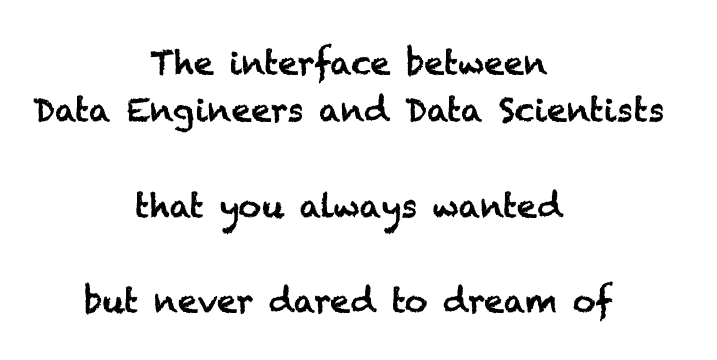

<div align="center">
  
</div>

# `dac`: Data as Code

Data-as-Code (DaC) `dac` is a tool that supports the distribution of data as (python) code.

<div align="center">
  
</div>


📔 [User documentation](https://data-as-code.github.io/py-dac/)


## Setup development environment (for contributors only)

* Create a virtual environment and activate it (if you have [pyenv](https://github.com/pyenv/pyenv) installed the
  version of python will be automatically set, otherwise refer to the file `.python-version`)
  ```shell
  python -m venv venv
  source venv/bin/activate
  ```

* Install the developer dependencies you will need
  ```shell
  python -m pip install -U pip wheel setuptools
  python -m pip install requirements-dev.txt
  ```

* Enable the pre-commits
  ```shell
  pre-commit install
  ```

* To run the tests
  ```shell
  python -m unittest discover test
  ```
