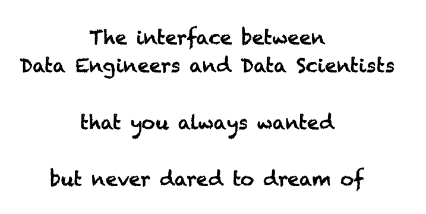

# `dac`: Data as Code

<div align="center">
  
</div>

Data-as-Code (DaC) `dac` is a tool that supports the distribution of data as (python) code.

<div align="center">
  
</div>


## How will the Data Scientists use a DaC package?

Say that the Data Engineers prepared the `demo-data` as code for you. Then you will install the code in your environment
```sh
python -m pip install demo-data
```
and then you will be able to access the data simply with
```python
from demo_data import load

data = load()
```

Depending on how the data was prepared, load may return a [pandas](https://pandas.pydata.org/), [dask](https://www.dask.org/), [pyspark](https://spark.apache.org/docs/latest/api/python/index.html), or [modin](https://github.com/modin-project/modin) dataframe. The limited choice is due to the fact that it must be supported by [pandera](https://pandera.readthedocs.io/en/stable/).

Not only accessing data will be this easy, but you will also have the [pandera schema model](https://pandera.readthedocs.io/en/stable/schema_models.html) associated with the data. How?
```python
from demo_data import Schema
```

With the schema you can, for example

* access the column names (e.g. `Schema.my_column`)
* unit test your functions by [synthetizining data](https://pandera.readthedocs.io/en/stable/data_synthesis_strategies.html)


## How can a Data Engineer provide a DaC python package?

Install this library
```sh
python -m pip install edg-dac
```
and use the command `dac pack` (run `dac pack --help` for detailed instructions).

On a high level, the most important elements you must provide are:

* python code to load the data. It should as a DataFrame in one of the supported libraries: [pandas](https://pandas.pydata.org/), [dask](https://www.dask.org/), [pyspark](https://spark.apache.org/docs/latest/api/python/index.html), or [modin](https://github.com/modin-project/modin)
* a [pandera ModelSchema](https://pandera.readthedocs.io/en/stable/schema_models.html) fitting the data that can be loaded
* python dependencies


## What are the advantages of distributing data in this way?

* The code needed to load the data, the data source, and locations are abstracted away from the user.
  This mean that the data engineer can start from local files, transition to SQL database, cloud file storage, or kafka topic, without having the user to notice it or need to adapt its code.

* Column names are passed to the user, and can be abstracted from the data source leveraging on the pandera  [`Field.alias`](https://pandera.readthedocs.io/en/stable/reference/generated/pandera.model_components.Field.html#pandera.model_components.Field). In this way, the user code will not contain hard-coded column names, and changes in data source column names won't impact the user.

* Users can build robust code by [writing unit testing for their functions](https://pandera.readthedocs.io/en/stable/data_synthesis_strategies.html) effortlessly.

* Semantic versioning can be used to communicate significat changes:

    * a patch update corresponds to a fix in the data: its intended content is unchanged
    * a minor update corresponds to a change in the data that does not break the schema
    * a major update corresponds to a change in the schema, or any other breaking change

  In this way data pipelines can subscribe to the appropriate updates. Furthermore, it will be easy to keep releasing data updates maintaining retro-compatibility (one can keep deploying `1.X.Y` updates even after version `2` has been rolled-out).

* Description of the data and columns can be included in the schema, and will therefore reach the user together with the data.

* Users will always know where to look for data: the PyPi index.
